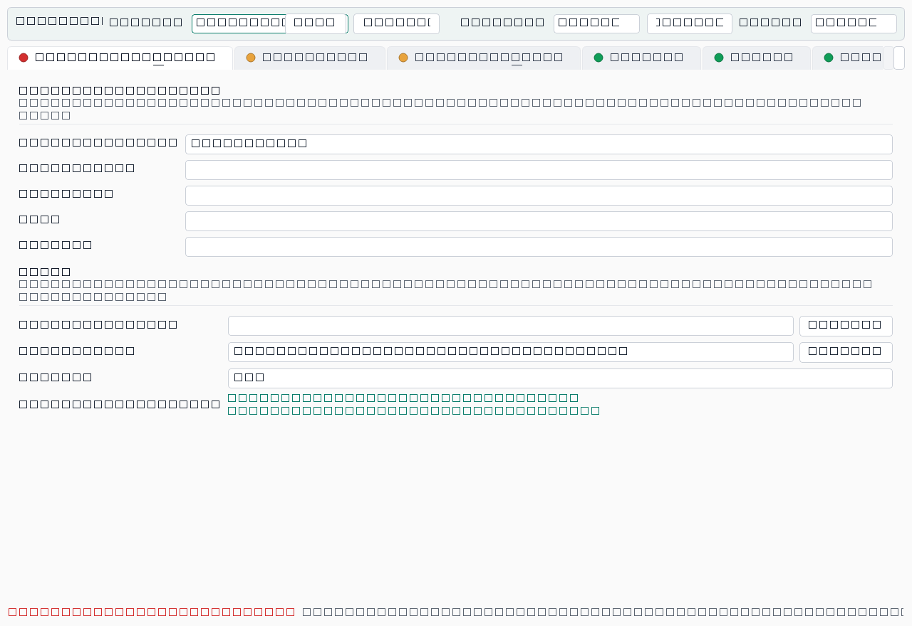

# fishsuite

[](https://github.com/SpaceSorcerer/fishsuite/actions/workflows/test.yml)

**Self-contained Python pipeline for RNA-FISH / immunofluorescence (IF) image quantification and colocalization — runs without Fiji or ImageJ.**

`fishsuite` segments nuclei (Cellpose / StarDist / Otsu), detects RNA-FISH spots (BigFISH LoG or plain LoG), measures per-nucleus spot counts, intensities and nuclear-vs-cytoplasmic distribution, and quantifies colocalization between two channels — including a literature-grounded **rotation "proper-background" null** for spot-vs-diffuse-protein association. It is built for *Homo sapiens* fluorescence microscopy (hESC and cardiomyocyte RNA-FISH / IF), runs from a single `fishsuite` command-line tool or a PySide6 GUI, and writes Excel-explorable result workbooks plus publication-ready figures.

- **Version:** 0.1.0
- **License:** MIT
- **Scope:** *Homo sapiens* only. Tooling, presets and conventions assume human hESC / d8-cardiomyocyte imaging.
- **Status:** `rna_only`, `rna_rna`, `rna_protein` and `if_intensity` are the production modes (validated end-to-end on H9 hESC, BIN1 d8-cardiomyocyte, MIAT×QKI colocalization and panQKI WT-vs-KO antibody-validation data). `ab_ab`, `protein_only` and `pub_images` are **not yet ported** — each is a one-line stub that aliases `rna_only` (see [Analysis modes](#analysis-modes)).
- **Self-contained:** the segmentation and spot-detection routines are the lab's own implementations, vendored verbatim into the package at `src/fishsuite/core/_vendor/`. Their source commit and per-file SHA-256 checksums are recorded in `core/_vendor/PROVENANCE.md` and enforced by `tests/test_vendor_parity.py`, so an installed copy can be shown to be the code that produced the published numbers. No Fiji, ImageJ or external script tree is required to run the pipeline.

> This README documents the actual source of this branch. Where a feature is opt-in, gated, or a stub, that is stated explicitly.

---

## Table of contents

1. [Overview](#overview)
2. [Highlights](#highlights)
3. [Installation and environment](#installation-and-environment)
4. [Quickstart](#quickstart)
5. [Analysis modes](#analysis-modes)
6. [The pipeline in depth](#the-pipeline-in-depth)
7. [Colocalization](#colocalization)
8. [CLI reference](#cli-reference)
9. [The desktop GUI](#the-desktop-gui)
10. [Configuration and presets](#configuration-and-presets)
11. [Outputs and metrics](#outputs-and-metrics)
12. [Statistics conventions](#statistics-conventions)
13. [Reproducibility](#reproducibility)
14. [Testing](#testing)
15. [Repository layout](#repository-layout)
16. [Citations and methods grounding](#citations-and-methods-grounding)
17. [Scope and limitations](#scope-and-limitations)
18. [Changelog / recent additions](#changelog--recent-additions)
19. [Contributing](#contributing)

---

## Overview

`fishsuite` is a standalone re-implementation of a Fiji image-analysis pipeline, written in pure Python so it can run headless, in parallel, and without ImageJ. It takes a folder of microscope images (`.tif`/`.tiff` and OME-TIFF in a base install; `.vsi`, `.czi`, `.lif`, `.nd2`, `.oib`/`.oif` with the [`bioformats` extra](#which-file-formats-a-base-install-can-read)) and produces a complete, condition-aware quantification of an RNA-FISH / IF experiment.

The pipeline is organized around four building blocks:

- **Nucleus segmentation** — Cellpose (incl. AMD-GPU via DirectML), StarDist, or Otsu, with border exclusion, label smoothing, optional Voronoi-expanded cytoplasm, and an opt-in ghost-nucleus rejection rule.
- **Spot detection** — BigFISH Laplacian-of-Gaussian (default) or a plain scikit-image LoG, with physically-sized spot kernels and an auto-threshold scaled by a user multiplier.
- **Colocalization** — whole-nucleus pixel coefficients (Pearson, Spearman, Manders M1/M2, Li ICQ, cosine, Jaccard, Dice), nearest-neighbor spot-to-spot pairing, and a spot-centric partner-intensity statistic tested against **three nulls** (position-randomization, rotation, translation).
- **Nuclear retention / N:C** — per-nucleus nuclear-vs-cytoplasmic spot fractions and intensity ratios — the floor-robust readout for RNA nuclear-retention experiments.

It is for wet-and-dry-lab biologists who acquire RNA-FISH / IF stacks and want reproducible, committee-defensible quantification with explorable Excel deliverables — without manual ImageJ work.

## Highlights

- **Single CLI** (`fishsuite`) with `run`, `preview`, `presets`, `init`, `gui` and three CPU-only post-run utilities (`backfill`, `walkthrough`, `postrun`).
- **PySide6 desktop GUI** (`fishsuite gui`) with channel auto-detection, per-file selection, live YAML preview and readiness checks.
- **Three production analysis modes**: `rna_only`, `rna_rna`, `rna_protein` (the last routes through the two-channel core with antibody-aware handling).
- **Diffuse-antibody handling** — treat a dense nuclear IF channel (e.g. QKI) as an intensity layer instead of spot-detecting it (`detect_antibody_spots: false`).
- **Rotation "proper-background" null** — a registration-destroying, structure-preserving control for whether a partner protein is concentrated at RNA spots *beyond* shared sub-nuclear compartmentalization.
- **Locked, defensible z-handling** — intensity-weighted autofocus with a central-fraction peak guard, and a fixed-N objective-window max-projection.
- **Excel-explorable deliverables** — `analysis_summary.xlsx` (PI report, column glossary, group comparison with Mann-Whitney U + Cliff's delta) and `analysis_raw_data.xlsx`.
- **Reproducibility built in** — global seed, deterministic nulls, `versions.txt` + `command.log` written at run start.
- **Parallel + GPU-aware** — memory/core-aware worker counts; cellpose on CPU, AMD (DirectML) or NVIDIA (CUDA); DirectML segmentation forced single-GPU.
- **Tested on Linux and Windows, Python 3.10 and 3.12** — see the CI badge above for the current status.

---

## Installation and environment

`fishsuite` is an editable-installed Python package. Two conda environments exist on the lab workstation:

| Env | Purpose |
|---|---|
| `fishproc_dml` | **DirectML / AMD GPU.** Required when a preset sets `nuclei.cellpose_device: directml`. |
| `fishproc` | **CPU fallback.** Use when a preset sets `cellpose_device: cpu`. The post-run utilities (`backfill`, `walkthrough`, `postrun`) are CPU-only and run in either env. |

> GPU is used **once**, during `fishsuite run`, for Cellpose nucleus segmentation (and accelerates the run overall). All post-run utilities are CPU-only. DirectML targets a single AMD GPU — run **one** GPU job at a time.

### Editable install

```powershell
# DirectML / AMD GPU env:
"C:\Users\ambur\miniconda3\envs\fishproc_dml\python.exe" -m pip install -e E:\Claude\fishsuite

# or the CPU env:
"C:\Users\ambur\miniconda3\envs\fishproc\python.exe"     -m pip install -e E:\Claude\fishsuite
```

This installs the `fishsuite` console script (entry point `fishsuite.cli:cli`).

### Dependencies

Runtime dependencies (from `pyproject.toml`):

`numpy>=1.24,<2.0`, `scipy>=1.10`, `scikit-image>=0.22`, `tifffile>=2024.1`, `stardist>=0.9`, `cellpose>=3.0,<4.0`, `torch>=2.0`, `big-fish>=0.6`, `pillow>=10.0`, `roifile>=2023.8`, `bioio>=3.0`, `pydantic>=2.5`, `click>=8.1`, `rich>=13.0`, `psutil>=5.9`, `pyyaml>=6.0`, `openpyxl>=3.1`, `pandas>=2.0`, `matplotlib>=3.7`.

### Which file formats a base install can read

**A base install reads TIFF and OME-TIFF only.** Proprietary microscope formats — `.vsi`, `.czi`, `.lif`, `.nd2`, `.oib`/`.oif` — go through Bio-Formats, which is an optional extra:

```bash
pip install fishsuite                 # TIFF / OME-TIFF
pip install "fishsuite[bioformats]"   # + .vsi .czi .lif .nd2 .oib/.oif
```

Bio-Formats runs on the JVM, so `[bioformats]` needs a **JDK installed**, and the Bio-Formats jars are downloaded on first use (so the first read needs network access). That is why it is opt-in: it is the single largest install-failure surface, and a user who only has TIFFs should not have to clear it.

It is also opt-in for a harder reason. `bioio-bioformats` depends on `bffile`, which declares `numpy>=2.1.0`, and fishsuite pins `numpy<2.0` because StarDist/TensorFlow require it. While `bioio-bioformats` sat in the base dependencies, **`pip install fishsuite` failed with `ResolutionImpossible` on every Python version.** The extra's floor is `>=1.3` rather than `>=2.0` so that pip can backtrack past that conflict to a version that resolves.

Optional extras:

| Extra | Installs | For |
|---|---|---|
| `bioformats` | `bioio-bioformats>=1.3` | `.vsi`, `.czi`, `.lif`, `.nd2`, `.oib`/`.oif`. Needs a JDK. |
| `gui` | `PySide6>=6.6` | `fishsuite gui` |
| `directml` | `torch-directml>=0.2` | AMD GPU cellpose (Windows only) |
| `all` | `bioformats` + `gui` | a normal interactive workstation |
| `dev` | pytest, hypothesis, ruff, build, twine | development |

> **Install the reader via the extra, not as a separate command.** `pip install "fishsuite[bioformats]"` resolves everything together and lands on numpy 1.26.4. Running `pip install bioio-bioformats` *afterwards* as its own command lets pip satisfy that package in isolation — observed to upgrade numpy to 2.2.6 and break the `numpy<2.0` pin that StarDist/TensorFlow need, silently, in an environment that had been working.

> **Do not install `bioio-tifffile` or another third-party bioio reader plugin to work around the above.** `bioio` picks a plugin per file, and a tifffile-based plugin resolves an ambiguous multi-plane TIFF's extra axis as **Z or T instead of C**. Channel indices then point at the wrong planes: DAPI segmentation runs on the RNA plane and **finds zero nuclei**, silently, with no error. If a run reports 0 nuclei on a multi-plane TIFF that clearly has nuclei, suspect reader axis inference first — check `n_channels` for the file and confirm it matches the channels you expect. Use the `bioformats` extra instead. (A guard that warns when a channel count looks like a mis-inferred time or z axis would be worth adding; it is not implemented yet.)

Python `>=3.10,<3.13`. The upper bound is forced by `numpy<2.0` (a TensorFlow/StarDist transitive constraint): there are no numpy 1.x wheels for CPython 3.13, so installing there tries to build numpy from source and fails.

### GPU acceleration

The GPU is used at exactly one step — Cellpose nucleus segmentation during `fishsuite run`. Every post-run utility is CPU-only. Set `nuclei.cellpose_device`:

| Value | Hardware | Install |
|---|---|---|
| `cpu` (default) | any | nothing extra |
| `cuda` | NVIDIA | a CUDA build of torch from pytorch.org |
| `directml` | AMD, Windows | `pip install "fishsuite[directml]"` |

`cuda` and `directml` both fall back to CPU with a warning on stderr rather than failing the run if the device turns out to be unavailable, so a config is portable across machines.

The two GPU paths are **not** interchangeable internally. DirectML has no sparse kernel, so the DirectML path builds the cellpose network in fp32 and forces the flow-dynamics / mask-reconstruction step back onto the CPU. CUDA has that kernel and does not get the workaround — applying it would strand most of the speedup. If you are reading the code, that branch is `_install_cuda_cellpose_route` in `core/segmentation.py`, and it is conditioned on `device == "directml"` specifically rather than on `device != "cpu"`.

DirectML targets a single AMD GPU — run one GPU job at a time.

> **Notes on numpy/Bio-Formats:** numpy is pinned `<2.0` for TensorFlow/StarDist compatibility. On import, `fishsuite` forces a headless matplotlib backend (`MPLBACKEND=Agg`) and applies a small `bffile` numpy-1 compatibility monkeypatch (`_apply_bffile_compat_patch` in `__init__.py`) so `bioio` works under numpy 1.x — that patch is *why* `bffile` runs fine on numpy 1.26.4 despite declaring `numpy>=2.1.0`, and it is a no-op when `bffile` is absent. Bio-Formats runs under a JVM; truncated/0-byte image files (`<512` bytes) are rejected before reaching it (a guard against native JVM crashes).

---

## Quickstart

Pick the preset closest to your experiment, dry-run it to verify the discovered roster, then run for real and check the outputs.

```powershell
# 1) List the built-in presets
fishsuite presets list

# 2) Print one to inspect/clone
fishsuite presets show h9_miat_kd_rerun_iwfocus_2026-05-31

# 3) ALWAYS dry-run first: discover inputs and print the plan, do NOT process
fishsuite run `
  -c "E:\Claude\fishsuite\src\fishsuite\config\presets\h9_miat_kd_rerun_iwfocus_2026-05-31.yaml" `
  -i "F:\Raw Images\H9-MIAT-KD-ASO\<dataset>" `
  -o "F:\Image Analysis Work\H9-Output\RUN_<descriptor>_<timestamp>" `
  --dry-run

# 4) Real run (new, timestamped output dir; raw input dirs are read-only)
fishsuite run `
  -c "E:\Claude\fishsuite\src\fishsuite\config\presets\h9_miat_kd_rerun_iwfocus_2026-05-31.yaml" `
  -i "F:\Raw Images\H9-MIAT-KD-ASO\<dataset>" `
  -o "F:\Image Analysis Work\H9-Output\RUN_<descriptor>_<timestamp>"

# 5) Check outputs (run-root master tables + workbook)
#    per_image_summary.csv, nuclei_metrics.csv, analysis_summary.xlsx,
#    qc_overlays/, publication_images/, masks/
```

The dry-run flag is exactly `--dry-run` (it exists only on `run`). Use a **new, descriptively-named, timestamped output directory for every run** — never overwrite a prior run's folder, and never write into a raw-image directory.

Single-image preview (debug):

```powershell
fishsuite preview "F:\Raw Images\...\image01.vsi" -c <preset>.yaml -o "F:\...\preview01"
```

Or the GUI:

```powershell
fishsuite gui
```

---

## Analysis modes

The mode is set by `channels.analysis_mode`. The dispatcher (`core/modes/__init__.py`) maps each mode name to its implementation:

| `analysis_mode` | Status | Channel roles | What it does |
|---|---|---|---|
| `rna_only` | Production | `dapi`, `rna` | One FISH target. Per-nucleus spot counts (nuclear/cyto/total), `nuclear_spot_fraction`, measured spot sizes, spot/peak intensities, nuclear-vs-cyto intensity (N:C), and thresholded compartment intensity. (Single channel → no pixel-pixel coloc.) |
| `rna_rna` | Production | `dapi`, `rna`, `rna2` | Two distinct FISH targets. Everything in `rna_only` per channel, **plus** spot-to-spot nearest-neighbor pairing, whole-nucleus pixel colocalization (Pearson/Spearman/Manders/Li ICQ/cosine/Jaccard/Dice), active-TS and mature-mRNA proxies, and (gated) partner-intensity + nulls. `rna2` is required. |
| `rna_protein` | Production | `dapi`, `rna`, `antibody` | FISH + IF. **Routes through the `rna_rna` core**: the antibody channel is mapped into the `rna2` slot, the full two-channel analysis runs, then every `rna2_*` output is relabeled `protein_*`. Supports diffuse-antibody handling. |
| `if_intensity` | Production | `dapi`, `antibody` | **Plate-level** antibody-validation intensity mode (no spot detection). Per-nucleus mean antibody intensity across a multi-well plate, routed per well from a `plate_layout_csv`; exposure filtering, fold-over-secondary-only normalization, cross-condition Welch statistics, SuperPlots, and shared-display micrographs. Because it is plate-level rather than per-image, `runner.run_batch` diverts to `run_if_batch` instead of the per-image `ImageResult` contract. |
| `ab_ab` | **Not yet ported** | — | One-line stub (`core/modes/ab_ab.py:7`) that calls `rna_only.run_one`. Selecting it gives you single-channel `rna_only` output, **not** two-antibody coloc. |
| `protein_only` | **Not yet ported** | — | One-line stub (`core/modes/protein_only.py:7`) that calls `rna_only.run_one`. For per-nucleus protein intensity today, use `if_intensity` (plate-level) or `rna_protein` with `detect_antibody_spots: false`. |
| `pub_images` | **Not yet ported** | — | One-line stub (`core/modes/pub_images.py:7`) that calls `rna_only.run_one`. To regenerate figures from a finished run, use the `fishsuite if-pub-images` / `walkthrough` / `postrun` subcommands instead. |

> The three stubs are registered so that `get_mode()` resolves them, and they are wired to `rna_only` rather than raising. They are **aliases, not implementations** — do not read their output as two-antibody or figures-only results.

### Channel roles and LUT-by-wavelength

Channel indices are configured per dataset (`channels.dapi/rna/rna2/antibody`, `-1` = auto-detect; 0-indexed unless `one_indexed: true`). The lab convention assigns pseudo-color **by emission wavelength, not by probe** — e.g. 640/647 → yellow, 561/568/594 → magenta, 488 → green, DAPI/405 → blue — via `*_lut` fields. Channel `*_label` fields name each channel in filenames and burned-in legends.

### Diffuse-antibody handling

In `rna_protein` mode, `rna_protein.run_one` calls the `rna_rna` core with `rna2_is_antibody=True`. When the antibody is a **diffuse, abundant nuclear protein** (e.g. QKI IF that fills the nucleoplasm rather than forming sparse puncta), spot-detecting it carpets every nucleus with meaningless "spots." Set:

```yaml
foci:
  detect_antibody_spots: false   # rna_protein only
```

With `detect_antibody_spots: false` **and** `rna2_is_antibody` (i.e. in `rna_protein`), the antibody channel is **not** spot-detected (empty spot set). The antibody **pixel** plane is still loaded, so pixel colocalization and the partner-intensity nulls — which sample antibody **pixels** at the RNA1 spots, never antibody spots — are unaffected. Plain `rna_rna` (two real FISH targets) always detects both channels regardless of this flag.

---

## The pipeline in depth

### Segmentation

`segment_nuclei(dapi_2d, backend, params)` dispatches to one of three backends:

- **StarDist** (`backend: stardist`, default model `2D_versatile_fluo`) — knobs: `prob_threshold`, `nms_threshold`, `n_tiles`, `stardist_gauss_sigma`, and an optional post-process (`stardist_postprocess` ∈ `none`/`dilate`/`watershed_otsu`/`watershed_triangle`). StarDist ignores diameter.
- **Cellpose** (`backend: cellpose`, default model `cpsam`) — knobs: `cellpose_diameter_px` (0 = auto), `cellpose_flow_threshold`, `cellpose_cellprob_threshold`. `cellpose_device: directml` enables the torch-DirectML GPU path; `cpu` is the legacy path.
- **Otsu** (`backend: otsu`) — pure thresholding.

> `stardist_model` and `cellpose_model_type` are plain strings in the schema (not restricted enums) — any model name is accepted; the defaults are `2D_versatile_fluo` / `cpsam`.

Common post-segmentation steps: an authoritative `[min_area_px, max_area_px]` area filter applied after smoothing; optional **label-boundary smoothing** (`label_smoothing_radius_px`, morphological close-then-open with a disk, to round StarDist star-convex corners); a **downsample speed lever** (`cellpose_downsample_factor`, applies to any backend); and **border exclusion** (`exclude_border` / `border_margin_px`).

**Ghost-nucleus rejection** (`reject_ghost_nuclei`, opt-in, default off) — a post-detection composite rule that flags a nucleus as an out-of-focus "ghost shell" **only if all three** hold: spot count `== 0`, area `>= reject_ghost_min_area_px` (default 6000 px), and nuclear DAPI CV `<= reject_ghost_max_dapi_cv` (default 0.12). Each condition alone is intentionally insufficient.

### Fixed-N nucleus sampling

The `sampling` block (opt-in, `enabled: false` by default) quantifies the **same number of nuclei in every field of view**. Without it, each condition's denominator is however many nuclei happened to land in each frame, so a confluent field and a sparse one contribute unequally to the same condition mean.

| Field | Default | Meaning |
|---|---|---|
| `enabled` | `false` | Master switch. Off means off — no selection, no extra columns, no `sampling_methods.txt`, byte-identical output to before. |
| `n_per_unit` | `20` | Nuclei to keep per unit. |
| `unit` | `per_image` | `per_image`. `per_well` is **not implemented** and raises at the start of a run — the allocation happens before any nucleus count is known and never redistributes an unused share, so it cannot deliver the equal per-well denominator it exists for. |
| `order` | `random` | `random`, `raster`, or `center_out`. |
| `seed` | `None` | Falls back to the run's global `seed`. |
| `on_short` | `keep` | What to do with a unit holding fewer than `n_per_unit`: `keep` it, `drop_unit`, or `fail` the run. |
| `min_eligible` | `0` | Units with fewer eligible nuclei than this are not sampled. |
| `apply_to_rollups` | `true` | Restrict the per-image rollups and pooled coloc nulls to the sampled set too, rather than sampling only the per-nucleus table. |

Supported in `rna_only`, `rna_rna`, `rna_protein`, `ab_ab`, `protein_only` and `pub_images`. `if_intensity` has its own per-nucleus loop and does not sample; enabling `sampling` there raises at the start of the run rather than writing a `sampling_methods.txt` describing a selection that never happened.

Two properties make it defensible. Sampling runs **last** in the filter chain (area → border → ghost → sample), so it selects among nuclei that already passed every quality filter rather than competing with them. And it selects using **only the DAPI channel and geometry — never the analysis channels**, so the choice of which nuclei to measure cannot be influenced by the quantity being measured. The selection is seeded and the criteria are written to `sampling_methods.txt` in the run directory.

The well remains the biological replicate; fields of view within a well are technical replicates. Fixed-N sampling equalizes the technical layer, it does not create replicates.

### Z-handling

The z mode is `z_stack.mode` ∈ `single`, `maxproj`, `autofocus`, `autofocus_maxproj`, `3d`. Per-slice focus is scored by `focus_metric` (default `variance_of_laplacian` = `var(laplace(plane / mean))`; the plane is mean-normalized so the score depends on gradient structure, not absolute brightness; also `tenengrad`, `normalized_variance`).

- **`autofocus`** — pick one in-focus DAPI plane; RNA/antibody channels are **locked to that same plane** (the nuclear mask and spot xy come from one physical plane, so disk-sampling stays co-registered).
- **`autofocus_maxproj`** — detect a DAPI focus *window*, then max-project that same window for DAPI and the RNA channel(s).

Two locked guards make the focus pick robust on thick / bright-throughout stacks:

- **`autofocus_intensity_weighted: true`** multiplies each slice's score by its mean (`var(laplace(plane/mean)) * mean`), pulling the peak to the bright **and** sharp nuclear plane instead of a dim/noisy stack edge. The plain (unweighted) metric can climb toward dim edge slices and pick garbage.
- **`focus_central_fraction`** (e.g. `0.6`) restricts the **peak search** to the central fraction of the stack, so the window anchor can never be a true edge plane.

Window selection is FWHM-based by default (walk outward while score `>= focus_threshold_frac * peak`, enforce `focus_window_min_slices` / `focus_window_max_slices`), or a **fixed-N centered window** when `focus_window_fixed_n_slices > 0` (constant integration depth across the batch; the window slides rather than shrinks at stack bounds). Per-image z windows can be pinned via `z_stack.file_overrides`.

### Spot detection

`detect_spots(rna, backend, ...)` returns one row per spot.

- **BigFISH LoG** (`backend: bigfish`, default) — auto-threshold from BigFISH, then re-run scaled by `threshold_multiplier` (`threshold = max(1, auto * multiplier)`), or use an explicit `threshold_override`. Spot size is physical: `bigfish_spot_radius_nm` (default 130), `bigfish_spot_radius_z_nm` (default 300), with voxel sizes feeding the LoG sigma and built-in local-max separation.
- **Plain LoG** (`backend: log`) — `log_spot_radius_px` (default 2.5) in pixels, threshold `log_threshold` (default 0.05) scaled by the multiplier.

Per-spot diameters are **measured** (moment-based 2D Gaussian FWHM), not assumed constant. Spot-to-compartment assignment (`in_nucleus`/`in_cytoplasm`, parent `nucleus_id`) is done downstream during stratification; "nuclear-only" analyses then filter on `in_nucleus`. An optional post-detection **floor filter** (`apply_pub_contrast_floor_to_spots`) drops spots whose peak intensity is below the channel's resolved floor.

### Thresholds

`thresholds.py` is a bit-identical port of the Fiji coloc threshold math:

- **MAD** (default): `median + k_mad * MAD` over raw nuclear pixels (**unscaled** MAD; `k_mad` default 2.0).
- **percentile**: a chosen percentile (default 80th).
- **Costes**: the genuine automatic Costes threshold (requires `>=20` pixels; scans descending thresholds until the below-threshold Pearson drops `<=0`). Its fallback uses `1.4826 * MAD` — note this differs from the plain (unscaled) MAD threshold.

Scope is `threshold_scope` ∈ `batch` (one pooled threshold over all images, computed in a pre-pass) or `per_image`. This pixel-coloc threshold is the **internal coloc cut**, distinct from (and usually much lower than) the spot-detection floor.

### Floors and the floor-robust readout

Display/analysis floors live in `output` (`pub_contrast_mode: manual` + `manual_<channel>_min/_max`; "Sam's method" tunes the retention-channel floor on the strongest-retention condition and applies the same floor everywhere). `apply_pub_contrast_floor_to_spots` gates spots below the floor; `apply_pub_contrast_floor_to_analysis` adds above-floor intensity columns.

Because absolute spot counts and intensities are floor-sensitive in **magnitude**, the headline nuclear-retention readout is **`nuclear_spot_fraction`** (% of a nucleus's spots that are nuclear) and the N:C ratios — these are floor-robust in direction. A third, spot-caller-independent view, **thresholded compartment intensity** (`compute_thresholded_compartment_intensity`), integrates the raw intensity of all pixels `>=` a settable floor separately in nucleus and cytoplasm, capturing diffuse + punctate above-floor signal. (See `THRESHOLD_INTENSITY_FEATURE.md`.)

### Parallelism

Worker counts are memory- and core-aware (`min(physical_cores - 2, available_RAM / per_worker_GB, cap)`), with per-worker BLAS/OMP thread caps to avoid oversubscription. **DirectML segmentation is forced to a single worker** (one GPU). `--parallel`/`-p` accepts `auto` (default) or an integer.

---

## Colocalization

`fishsuite` measures colocalization at several levels (in `rna_rna` / `rna_protein`), from whole-nucleus pixel coefficients down to a spot-centric statistic with explicit nulls. Which one is appropriate depends on whether the partner channel has a thresholdable object at all — §5 is the diagnostic that tells you.

### 1. Pixel colocalization (whole-nucleus)

`compute_coloc_metrics` operates on the two channels' pixels inside each nuclear mask, thresholded at the run's pixel-coloc thresholds, and returns: **Pearson** `r`, **Spearman** `rho`, **Li ICQ** (fraction of pixels with co-varying intensity, minus 0.5), **cosine overlap**, **Manders M1/M2**, **Jaccard**, **Dice**, plus reciprocal enrichment ratios and overlap fractions. For a diffuse, abundant partner these whole-nucleus coefficients wash out (the partner fills the nucleus), which is why the spot-centric nulls below are the headline for spot-vs-diffuse cases.

**Per-image rollups.** All nine coefficients are also summarized to the per-image sheet as `mean_` / `median_` / `sd_` / `n_nuclei_in_` for each coefficient — 36 columns, generated from one table rather than hand-written, with a test asserting the glossary and the emitting code agree so a column cannot go undocumented. This exists because **the per-image mean is the lab's replicate unit**: treating each nucleus as an independent observation is pseudoreplication, and a coefficient reported per nucleus invites exactly that. `sd_` is the sample SD (`ddof=1`) and is NaN when only one nucleus contributed — one observation has no spread. `n_nuclei_in_` is the denominator behind the other three, which also makes it the place to see whether nucleus sampling restricted the rollup.

### 2. Spot-to-spot pairing

A `scipy.spatial.cKDTree` nearest-neighbor search pairs spots across channels in 3D: per-spot `nn_distance_um` and `paired_at_<X>um` (X = `spot_coloc.pair_distance_um`, default 0.3 µm), aggregated to per-nucleus / per-image paired fractions and median NN distances. Nuclear + paired spots serve as an active-transcription-site proxy.

### 3. Partner-intensity statistic and nulls (spot-centric, floor-robust)

For each RNA1 spot, the partner channel's mean intensity is sampled in a small disk (`partner_null_disk_px`, default 3.0 px) on the **same z-locked plane**, using **raw** intensity (so the metric does not move when the display/spot floor moves). The per-nucleus observed statistic is the mean of those disk-means over the nucleus's RNA1 spots. It is tested against three nulls (all opt-in; all require `compute_partner_intensity: true`):

**(a) Position-randomization null** (`compute_partner_null_enrichment`) — re-place the same number of spots uniformly within the nucleus and re-sample. Controls for spot count and nuclear geometry. *Limitation (stated in code):* it does **not** control for co-distribution — if both channels prefer the same sub-nuclear regions, enrichment is inflated.

**(b) Rotation "proper-background" null** (`compute_partner_rotation_null`) — the headline control. Instead of randomizing positions, it **rotates the entire RNA1 spot constellation rigidly about its own centroid**, preserving the spot pattern's internal geometry while destroying its registration to the (fixed) partner field. `observed > rotation-null` therefore means the partner is concentrated at the spots **beyond shared sub-nuclear compartmentalization**. Implementation details (function `_rotation_null_for_nucleus` in `core/modes/rna_rna.py`):

- First three rotations are exactly **90°, 180°, 270°**; the remaining `partner_rotation_n - 3` (default 1000 total) are uniform on `[0, 360)`.
- **Keep-N redraw:** any spot rotated out of the nuclear mask is **redrawn** (fresh per-spot angle, up to 40 retries) rather than dropped — dropping shrinks the active spot count and biases enrichment low. Spots that remain unplaceable fall back to their observed position (rare).
- **Usability gate:** a nucleus is usable only if median first-pass in-mask retention `>= partner_rotation_min_retention` (default 0.5) and at least 2 valid draws exist (`rotation_null_usable`). Only usable nuclei contribute to the pooled rotation null.
- **Association fraction** (`partner_rotation_assoc_percentile`, default 95.0) — the fraction of observed spots whose own disk-mean partner exceeds the high-percentile threshold of a single-spot rotation null (chance level `= 1 - pct/100`, i.e. 0.05 at the 95th percentile). Reads as "X% of RNA spots sit in partner-rich neighborhoods beyond the rotation-chance level."

**(c) Translation null** (`compute_partner_translation_null`) — a rigid-shift companion. **Flagged unreliable for dense / space-filling spot patterns** (most shifts push too many points out of the mask, biasing enrichment low). Use rotation as the headline; translation is supplementary at best.

Supporting control: **nucleolus exclusion** (`exclude_nucleolus_from_partner_null`, with `nucleolus.enabled`) removes DAPI-poor nucleolar voids — which an abundant nuclear protein also avoids — from **both** the null positions and the observed spots, so mutual nucleolar avoidance cannot inflate enrichment.

All nulls use fixed seeds with separate RNG streams (position `partner_null_seed`; rotation offset +101; association +404), so toggling one never perturbs another, and the post-run `backfill` reproduces the engine's draws bit-for-bit.

### 4. Radial profile — the metric that fits a diffuse partner

`compute_partner_radial_profile` measures the partner channel's enrichment in concentric annuli around each RNA1 spot (`partner_radial_bins_um`, outer-edge radii in µm, default `[0.25, 0.5, 0.75, 1.0]`). It is the 2-D analogue of a line scan, and it is the one metric here that needs **no thresholdable object in the partner channel** — only the partner's intensity as a function of distance from an object in the punctate channel. For a diffuse, abundant partner, that makes it the appropriate readout rather than a supporting one.

It reports at every level: per-nucleus enrichment-by-distance columns, and per-image columns in both flavours — the spot-count-weighted pool and the equal-weight per-nucleus rollup, the latter being the replicate-level statistic. It also emits a **mean ± 95% CI profile table and figure**, so the distance dependence can be read directly instead of inferred from a wall of columns.

One deliberate hard failure: because every distance bin is specified in µm and converted using the image's own µm/px, a substituted or missing pixel size would silently rescale every bin. The radial path **refuses to run** on an image whose pixel size it cannot trust rather than emitting quietly-wrong distances.

### 5. Spot-callability diagnostic

Advisory, run-level, and computed automatically wherever secondary-only (no-probe) control images are present. For each punctate channel it reports three columns on every per-image row (they are run-level constants, so a reader does not have to re-derive them):

| Column | Meaning |
|---|---|
| `spot_rate_sample_per_nucleus_<ch>` | mean spots per nucleus across the sample images |
| `spot_rate_seconly_per_nucleus_<ch>` | the same, on the secondary-only controls, using the identical detector and settings |
| `spot_rate_signal_to_control_<ch>` | the ratio of the two |

The point is to answer a question the pipeline could always compute but never showed: **does the spot detector actually discriminate in this channel?** A ratio near 1 means it finds as many "spots" in the no-probe control as in the sample. That channel has no thresholdable object, and every mask-based coefficient derived from it — Manders, ICQ, Jaccard, Dice — is then measuring textured background. For such a channel the honest read is a threshold-free correlation plus a rotation null, or the radial profile above.

It never drops an image or fails a run; it is a flag on results you would otherwise over-interpret. `foci.min_spot_signal_to_control` (default 2.0) sets where the warning fires.

These methods follow the colocalization-with-an-explicit-null tradition: pixel coefficients (Manders 1993; Pearson) require a chance model (Costes 2004; van Steensel 1996), object/spot association is tested against a mask-constrained random placement (Lagache/SODA 2018), and the defensible null must **destroy registration while preserving each channel's own structure** (Dunn 2011; Aaron 2018). See [Citations](#citations-and-methods-grounding). The rotation "proper-background" null is **our own construction** in the registration-destroying tradition — not attributable to a single methods paper.

---

## CLI reference

The console script is **`fishsuite`** (entry point `fishsuite.cli:cli`). It exposes `--version` and the subcommands below. Quoting paths with spaces is required on Windows.

### `fishsuite run`

Run the full pipeline on a folder of images.

| Option | Required | Default | Meaning |
|---|---|---|---|
| `-c`, `--config` | yes | — | Path to a fishsuite YAML config / preset. |
| `-i`, `--input-dir` | yes | — | Folder of images (or folder of subfolders). |
| `-o`, `--output-dir` | yes | — | Where to write outputs. |
| `-p`, `--parallel` | no | `auto` | Worker count: `auto` or an integer (string, resolved downstream). |
| `--resume` | no | off | Skip images that already have outputs. |
| `--dry-run` | no | off | Discover inputs and print the plan; do **not** process. |
| `-v`, `--verbose` | no | off | Print full tracebacks on per-image failures. |

```powershell
fishsuite run -c preset.yaml -i "F:\Raw Images\UD" -o "F:\out\UD_run" --dry-run
```

### `fishsuite preview`

Run the pipeline on a single image (preview / debug); processes the image's parent folder with `parallel=1`.

```powershell
fishsuite preview "F:\Raw Images\UD\img01.vsi" -c preset.yaml -o "F:\out\preview01"
```

Required options: `-c/--config`, `-o/--output-dir`. (No `--dry-run`/`--parallel`/`--resume`.)

### `fishsuite presets`

Manage built-in presets.

```powershell
fishsuite presets list                  # print "<stem>\t<path>" for every shipped *.yaml
fishsuite presets show <name>           # print the named preset's YAML (exit 2 if not found)
```

### `fishsuite init`

Placeholder setup command. Prints info and lists the shipped preset YAMLs; it does not (yet) run an interactive wizard.

### `fishsuite gui`

Launch the PySide6 desktop launcher (requires the `gui` extra / `PySide6`). See [The desktop GUI](#the-desktop-gui).

### Post-run utilities (CPU-only)

These operate on a **completed run directory** (one containing `run_config.json`, `per_image_summary.csv`, `nuclei_metrics.csv`, `masks/`). They reuse saved masks + spots and never re-segment, re-detect, or touch the GPU. Errors are plain-English (exit 2 for user-fixable issues). Source VSIs are auto-detected from the run's recorded `input_dir`; pass `--staging` if auto-detection fails.

#### `fishsuite backfill`

Retrofit colocalization products onto an existing run.

| Option | Default | Meaning |
|---|---|---|
| `--run` | (required) | Completed run output directory. |
| `--staging` | auto-detect | Folder holding the source VSIs. |
| `--input` | auto-detect | Alternate source folder (rarely needed). |
| `--seed` | 0 | RNG seed for the null/montage (deterministic). |
| `--no-null-draws` | off | Skip writing the null-draw CSV(s). |
| `--no-radial` | off | Skip writing `coloc_radial_profile.csv`. |
| `--no-montage` | off | Skip the partner-enrichment montage PNG. |
| `--rotation` | off | **Also** compute the rotation "proper-background" null (writes `coloc_rotation_null_summary.csv` + `coloc_rotation_null_draws.csv`). Opt-in. |

The three `--no-*` flags are negative-only (products are on by default); `--rotation` is positive opt-in. `backfill` self-validates pooled numbers against the run's stored records and warns (exit 1) on mismatch.

```powershell
fishsuite backfill --run "F:\Image Analysis Work\MIAT-QKI-Coloc\my_run"
fishsuite backfill --run "F:\...\my_run" --rotation --seed 0
fishsuite backfill --run "F:\...\my_run" --no-null-draws --no-radial
```

#### `fishsuite walkthrough`

Build the 8-panel pipeline-walkthrough figure for one representative image.

| Option | Default | Meaning |
|---|---|---|
| `--run` | (required) | Completed run output directory. |
| `--image` | auto-pick | Panel-prefix image key. |
| `--out` | `<run>/figures/07_coloc/79_pipeline_walkthrough.png` | Output PNG path (created). |
| `--staging` / `--input` | auto-detect | VSI source for the rendered panel. |

The figure is a 2×4 grid (600 DPI): (A) DAPI, (B) nucleus segmentation, (C) RNA FISH, (D) RNA spot detection, (E) protein IF, (F) thresholded protein, (G) RNA spots on thresholded protein (freshly rendered at the DAPI autofocus z), (H) merge. Missing panels self-skip with a gray placeholder.

```powershell
fishsuite walkthrough --run "F:\...\my_run"
fishsuite walkthrough --run "F:\...\my_run" --image "g2_wDox_(MIAT_OE)__g2-Dox_01" --out "F:\figures\wt.png"
```

#### `fishsuite postrun`

One-shot "make my figures": runs `backfill` then `walkthrough`, prints a per-step progress line, continues past a failed step, and exits non-zero if any step failed. (No `--no-*`, no `--rotation`, no `--out`; its backfill step writes null-draws + radial + montage but **not** the rotation null.)

```powershell
fishsuite postrun --run "F:\Image Analysis Work\MIAT-QKI-Coloc\my_run"
```

> The legacy module entry points still work: `python -m fishsuite.core.coloc_backfill` and `python -m fishsuite.core.walkthrough_figure`. The subcommands are friendlier wrappers. See `POSTRUN_UTILITIES.md`.

---

## The desktop GUI

`fishsuite gui` opens a PySide6 launcher over the same config model and the same runner the CLI uses — it writes a YAML config and shells out to `fishsuite run`, so a GUI run and a CLI run are the same run.



The settings are split across tabs, each carrying a **readiness dot**: green means that tab has everything it needs, amber means it is usable but something is still defaulted or guessed, red means the run will not start until you fix it. The status line at the bottom names the specific blocking problem rather than only reporting that one exists. Alongside the form it offers channel auto-detection from the image metadata, per-file selection for running a subset, and a live YAML preview so you can see exactly what config the run will get — and save it, which is the recommended way to produce a reusable preset.

The GUI follows the OS light/dark theme; `docs/gui_dark.png` shows the dark variant.

The GUI needs the `gui` extra (`pip install "fishsuite[gui]"`). It is a launcher, not a viewer: it does not display results, because the run writes its own QC overlays, publication images and Excel workbooks.

---

## Configuration and presets

Configuration is a Pydantic v2 YAML model (`config/schema.py`). `FishsuiteConfig.from_yaml(path)` loads and validates; omitted blocks fall back to defaults. The config is grouped into blocks: `experiment`, `conditions`, `channels`, `z_stack`, `nuclei`, `sampling`, `pixel_coloc`, `spot_coloc`, `foci`, `cytoplasm`, `nucleolus`, `output`, `parallel`, `qc`, `if_intensity`, plus top-level `seed` (default 0) and `input_file_subset` (default `[]`).

### The minimal working config

Every block has defaults, so a runnable config is short. This is a complete one — copy it, point `fishsuite run` at a folder whose subfolders are named `control/` and `treated/`, and it works:

```yaml
experiment:
  name: my_first_run
channels:
  analysis_mode: rna_only
  dapi: 0                # 0-indexed; -1 = auto-detect from channel metadata
  rna: 1
conditions:
  mode: subfolders
  subfolder_conditions: {control: Control, treated: Treated}
nuclei:
  backend: stardist      # or otsu, which needs no ML dependency
  min_area_px: 2000      # in PIXELS — scale this to your pixel size
foci:
  backend: bigfish
  bigfish_spot_radius_nm: 150.0   # physical spot radius, not pixels
```

Two fields are worth setting deliberately rather than inheriting: `nuclei.min_area_px` is in pixels, so the right value depends on your objective and camera (the shipped presets are named after the pixel size they assume), and `foci.bigfish_spot_radius_nm` is a physical size that BigFISH converts to a kernel using the image's own µm/px. Getting either wrong is the most common cause of a first run that produces nothing or produces thousands of spurious spots.

For anything real, start from the closest shipped portable preset instead — see [Portable presets](#portable-presets-vs-run-records) below.

### Selected fields and real defaults

**`channels`** — `analysis_mode` (default `rna_only`; one of `rna_only`/`rna_protein`/`rna_rna`/`if_intensity`, plus the three not-yet-ported aliases `ab_ab`/`protein_only`/`pub_images`); indices `dapi`/`rna`/`rna2`/`antibody`/`antibody2` (default `-1` = auto-detect; `one_indexed: false`); LUTs `dapi_lut`=`blue`, `rna_lut`=`yellow`, `rna2_lut`=`magenta`, `antibody_lut`=`green`, `ab2_lut`=`magenta`; labels default `DAPI`/`RNA1`/`RNA2`/`Protein`/`Protein2`.

**`z_stack`** — `mode` (default `autofocus`; `single`/`maxproj`/`autofocus`/`autofocus_maxproj`/`3d`); `start_slice`/`end_slice` (None); `autofocus_intensity_weighted` (False); `focus_central_fraction` (0.0 = off); `focus_metric` (`variance_of_laplacian`); `focus_threshold_frac` (0.5); `focus_window_min_slices` (3); `focus_window_max_slices` (0); `focus_window_fixed_n_slices` (0); `focus_min_intensity_frac_of_peak` (0.0); `file_overrides` (`{}`).

**`nuclei`** — `backend` (`stardist`; or `cellpose`/`otsu`); `prob_threshold` (0.5); `nms_threshold` (0.5); `stardist_model` (`2D_versatile_fluo`, free string); `cellpose_model_type` (`cpsam`, free string); `cellpose_diameter_px` (0.0 = auto); `cellpose_downsample_factor` (1.0); `cellpose_device` (`cpu`; or `directml` for AMD, `cuda` for NVIDIA — see [GPU acceleration](#gpu-acceleration)); `min_area_px` (10000); `max_area_px` (1e12); `label_smoothing_radius_px` (0); `exclude_border` (True) / `border_margin_px` (5); `reject_ghost_nuclei` (False) / `reject_ghost_max_dapi_cv` (0.12) / `reject_ghost_min_area_px` (6000).

**`sampling`** — fixed-N nucleus sampling; `enabled` (False), `n_per_unit` (20), `unit` (`per_image`; `per_well` is not implemented and raises), `order` (`random`; or `raster`/`center_out`), `seed` (None = the run seed), `on_short` (`keep`; or `drop_unit`/`fail`), `min_eligible` (0), `apply_to_rollups` (True). See [Fixed-N nucleus sampling](#fixed-n-nucleus-sampling).

**`pixel_coloc`** — `threshold_mode` (`mad`; or `percentile`/`costes`); `threshold_scope` (`batch`; or `per_image`); `k_mad` (2.0); `percentile` (80.0).

**`spot_coloc`** — `pair_distance_um` (0.3); `report_nn_distance` (True).

**`foci`** — `backend` (`bigfish`; or `log`); `bigfish_spot_radius_nm` (130.0); `bigfish_spot_radius_z_nm` (300.0); `threshold_multiplier` (0.7); `only_nuclear_spots` (False); `min_sep_px` (1); `log_spot_radius_px` (2.5) / `log_threshold` (0.05); per-channel `rna_overrides`/`rna2_overrides`/`antibody_overrides`; `compute_partner_intensity` (False); `detect_antibody_spots` (True). Null/coloc cluster (all default off unless noted): `compute_partner_null_enrichment` (False), `partner_null_n` (1000), `partner_null_disk_px` (3.0), `partner_null_seed` (0), `exclude_nucleolus_from_partner_null` (False), `save_partner_null_draws` (False), `compute_partner_radial_profile` (False), `partner_radial_bins_um` (`[0.25, 0.5, 0.75, 1.0]`), `compute_partner_rotation_null` (False), `partner_rotation_n` (1000), `partner_rotation_seed` (0), `partner_rotation_min_retention` (0.5), `partner_rotation_assoc_percentile` (95.0), `compute_partner_translation_null` (False), `save_partner_rotation_null_draws` (False).

**`cytoplasm`** — `enabled` (True); `voronoi_max_expansion_px` (80); `measure_nc_ratio` (True).

**`nucleolus`** — `enabled` (False); `intra_nuclear_percentile` (25.0); `min_area_um2` (1.0); `max_area_frac_of_nucleus` (0.6); `closing_radius_px` (2); `min_border_distance_px` (5).

**`output`** — save toggles `save_qc_overlays`/`save_per_image_csv`/`save_masks`/`save_publication_images` (True), `save_publication_tifs` (False); `pub_contrast_mode` (`auto_batch`; or `auto_per_image`/`manual`/`reference_image`) with percentile knobs (`pub_contrast_floor_pct` 98.0, `pub_contrast_ceil_pct` 99.9, `pub_contrast_dapi_floor_pct` 40.0, `pub_contrast_dapi_ceil_pct` 99.9, `pub_contrast_rna_floor_bump_pct` 10.0); manual floors `manual_<dapi|rna|rna2|antibody>_min/_max` (None); `apply_pub_contrast_floor_to_analysis` (False) / `apply_pub_contrast_floor_to_spots` (False); `rna_intensity_threshold` / `rna2_intensity_threshold` (None); `scalebar_um` (50.0).

**`qc`** — `qc_min_nuclei` (5); `qc_saturated_frac` (0.01); `qc_min_focus_score` (0.0 = focus never flags). QC columns are advisory only; no image is ever dropped.

**`parallel`** — `workers`/`seg_workers` (`auto`); `main_workers` (1); `threads_per_worker` (4).

### Cloning a preset

Clone the closest shipped preset and retarget channels/floors per dataset — never write a config from scratch, and don't improvise z-handling, floor, or output-dir naming.

```powershell
fishsuite presets show bin1_d8cmyo_100x > my_new_preset.yaml
# edit channel indices/labels/LUTs, z-handling, and floors, then run --dry-run
```

### Portable presets vs run records

The presets folder holds two different kinds of file, and confusing them wastes time.

**Six presets are portable starting points.** They are marked with a `# portable: true` comment on line 1 and are the only ones shipped inside the built wheel:

| Portable preset | Mode | Use when |
|---|---|---|
| `generic_100x_0p065.yaml` | rna_only | One FISH target. 100× objective, ~0.065 µm/px. |
| `generic_60x_0p108.yaml` | rna_only | One FISH target. 60× objective, ~0.108 µm/px. |
| `u2os_100x.yaml` | rna_only | U2OS, 100×. |
| `hek293_60x.yaml` | rna_only | HEK293, 60×. |
| `generic_rna_rna_100x.yaml` | rna_rna | **Two FISH probes.** Spot-to-spot pairing + whole-nucleus pixel coloc. |
| `generic_rna_protein_100x.yaml` | rna_protein | **FISH × diffuse antibody.** The diffuse-partner path: `detect_antibody_spots: false`, partner-intensity statistic, position + rotation nulls, and the radial profile all enabled. |

The last two are written from scratch as templates rather than stripped from a lab run, and they are commented at length — particularly `generic_rna_protein_100x.yaml`, which explains *why* a nucleoplasm-filling protein must not be spot-detected. If you are doing colocalization with an abundant nuclear protein, read that file before configuring anything: it is the case the tool is best at and the one most easily gotten wrong.

**Everything else is a run record** — the provenance of a specific figure, kept so that a published result can be traced back to the exact settings that produced it. They are not templates. Most carry an `input_file_subset` listing the author's own image filenames, `z_stack.file_overrides` keyed to literal filenames, or `cellpose_device: directml` (AMD-only), so running one unchanged on another machine will discover zero images or fail on the device. They stay in the repository for provenance but are **excluded from the built wheel**, so a `pip install fishsuite` ships only the six portable ones.

`h9_rna_rna_test.yaml` and `h9_rna_rna_test_labeled.yaml` deserve a specific warning, because they look portable and are not: they carry no absolute paths and no file subset, but their `subfolder_conditions` are keyed to the author's folder names, and **their `rna2` channel contains no probe** — the headers say so, and the labelled variant names it `Empty-Cy3`. They are two-channel infrastructure checks, not two-probe experiments. Use `generic_rna_rna_100x.yaml`.

If you cloned the repository rather than pip-installing, `fishsuite presets list` will show all of them. Read the header comment before reusing one.

### Built-in presets

Shipped presets live in `src/fishsuite/config/presets/`. Representative ones (all but the last two rows are run records, per the section above):

| Preset | Mode | Purpose |
|---|---|---|
| `h9_hesc_100x.yaml` | rna_only | H9 hESC 100x baseline (DAPI + RNA). |
| `h9_miat_kd_rerun_iwfocus_2026-05-31.yaml` | rna_only | Committee-grade H9 MIAT NT-vs-KD with the objective windowed-MIP z-handling. |
| `h9_miat_kd_aso_cellpose.yaml`, `..._stardist_ds3.yaml`, `h9_miat_kd_0505_rerun_*`, `h9_miat_kd_0506_descriptive_*`, `h9_miat_kd_aso_DECONV_*` | rna_only | H9 MIAT-KD variants (backend / dataset / deconvolution-specific). |
| `miat_oe_ud_g2_rna_only_2026-06-03.yaml` | rna_only | Undifferentiated hESC g2 MIAT overexpression (Dox-inducible) FISH. |
| `bin1_d8cmyo_100x.yaml` | rna_rna | BIN1 d8 cardiomyocyte exon/intron retention (KO vs WT). |
| `bin1_d8cmyo_*` (XRN2, QKIKO4-2, RNaseTreat variants) | rna_rna | BIN1 d8-cMyo follow-ups. |
| `h9_rna_rna_test.yaml`, `..._labeled.yaml` | rna_rna | Two-channel infrastructure validation on H9 data (the 561 channel is an unused stand-in — not a real two-probe experiment). |
| `miat_qki_coloc_ud_g2_PLAIN_strictMIAT_2026-06-05.yaml` | rna_protein | MIAT × QKI coloc, g2 control vs MIAT-OE, diffuse-partner; rotation/null products on. |
| `miat_qki_coloc_ud_ALLARMS_PLAIN_strictMIAT_2026-06-05.yaml` | rna_protein | MIAT × QKI coloc, all three dCas9-VPR arms × ±Dox in one run. |
| `miat_qki_coloc_ud_g2_rna_protein_2026-06-04.yaml` | rna_protein | Earlier g2 MIAT × QKI coloc pilot. |
| `miat_qki_coloc_d4CM_decon_2026-06-20.yaml`, `..._d8CM_...`, `..._d15CM_...` | rna_protein | MIAT × QKI coloc on d4/d8/d15 cardiomyocytes (deconvolved). |
| `miat_qki_EXPLORATORY_qkifoci_*` | rna_protein | Exploratory QKI-foci tuning variants. |
| `generic_60x_0p108.yaml`, `generic_100x_0p065.yaml` | rna_only | **Portable.** Generic single-FISH starting points at the named pixel sizes. |
| `hek293_60x.yaml`, `u2os_100x.yaml` | rna_only | **Portable.** Generic cell-line single-FISH templates. |
| `generic_rna_rna_100x.yaml` | rna_rna | **Portable.** Generic two-probe template. |
| `generic_rna_protein_100x.yaml` | rna_protein | **Portable.** Generic FISH × diffuse-antibody template with the nulls and radial profile on. |

> `presets list` prints every `*.yaml` in the presets folder, which may include local scratch presets (e.g. `_tmp_*`); those are not official shipped presets.

---

## Outputs and metrics

A run writes a complete, condition-aware output tree. Per-image files are condition-prefixed (`<condition>__<stem>__<suffix>`); an optional `output.prefix` is prepended to all names.

### Directory layout

```
<output_dir>/
  per_image_summary.csv      # master, one row per image
  nuclei_metrics.csv         # master, one row per nucleus
  spot_metrics.csv           # master, one row per spot (has a `channel` column)
  cell_morphology.csv        # master, one row per nucleus (shape)
  thresholds.csv             # master, per-image threshold record
  coloc_null_draws.csv       # only when save_partner_null_draws is on
  coloc_radial_profile.csv   # only when the radial-profile feature is on
  coloc_rotation_null.csv    # only when save_partner_rotation_null_draws is on
  analysis_summary.xlsx      # PI report workbook
  analysis_raw_data.xlsx     # raw-data workbook
  run_config.json            # full resolved config + provenance
  versions.txt               # tool versions + seed (written at run start)
  command.log                # argv + config + seed (written at run start)
  qc_overlays/               # QC composite + segmentation-on-DAPI PNGs
  per_image_csv/             # per-image nuclei + spot CSVs (+ optional channel-split spot CSVs)
  masks/                     # per-image label/mask TIFFs + per-image thresholds.csv
  publication_images/        # per-channel pseudo-colored PNGs (+ optional 16-bit TIFs) and merges
  pipeline_walkthrough/      # step01..stepNN methods micrographs
  nuclei_popouts/            # representative single-nucleus crops
  nucleolus_overlay/         # nucleolus overlays (populated only in nucleolus-aware runs)
  _downstream_plots.log      # log of the optional downstream figure step
```

> **`figures/` is produced by an optional bundled downstream step, not by fishsuite itself.** At the end of a run, the runner shells out to an external script (`python -m analysis.single_condition_plots`) that creates `figures/` (and subfolders such as `figures/07_coloc/`). The `walkthrough` utility also writes its figure to `figures/07_coloc/79_pipeline_walkthrough.png` by default (creating that path).

### Master CSVs and key columns

- **`per_image_summary.csv`** (the replicate-level table): per-image spot totals and per-nucleus rollups — `total_spots`, `total_spots_rna1/rna2`, `mean/median/cv_spots_per_nucleus(_rna1/_rna2)`, `frac_nuclear_rna1/rna2`, `frac_nuclei_with_ge_{1,5,10}_spot(s)`, intensity rollups, pairing (`paired_fraction_*_at_0p3um`, `median_nn_distance_*_um_all_spots_in_frame` — the bare `median_nn_distance_*_um` name survives per nucleus only, alongside the `mean/median/sd_median_nn_distance_*_um_per_nucleus` rollups), and — when the partner-null features are on — the **pooled null summary columns** (e.g. `rna2_pooled_enrichment_vs_null_at_rna1_spots`, `rna2_pooled_rotation_enrichment_at_rna1_spots`, with their pooled null mean / z / empirical p; relabeled `protein_*` in `rna_protein`).
- **`nuclei_metrics.csv`** (per nucleus): `rna_spot_count`, `nuclear_spot_count`, `cyto_spot_count`, **`nuclear_spot_fraction`**, `nuclear_spot_density_per_um2`, raw intensities and `rna_nc_ratio` / `nc_ratio_total_intensity_*`, spot peak-intensity aggregates, the thresholded-compartment columns (`rna_thresh_total/mean_intensity_*`, `_pos_area_px_*`, `_pos_fraction_*`, `rna_thresh_floor`, plus `rna2_thresh_*`/`protein_thresh_*`), pairing, the Manders/Pearson/etc. per-nucleus coloc columns, and — when on — the per-nucleus partner columns (`rna2_enrichment_vs_null_at_rna1_spots`, `rna2_rotation_enrichment_at_rna1_spots`, `rna2_rotation_assoc_fraction_at_rna1_spots`, `rotation_null_usable`).
- **`spot_metrics.csv`** (per spot): `channel` (`rna1`/`rna2`/`protein`), `spot_id`, `nucleus_id`, `in_nucleus`, `in_cytoplasm`, `x_px`/`y_px`/`z_slice`, `spot_peak_intensity`, measured `spot_fwhm_px`/`spot_diameter_um`/`spot_area_px`, `nn_distance_um`, `paired_at_0p3um`.
- **`cell_morphology.csv`**: per-nucleus `area_um2`, `perimeter_um`, `circularity`, `aspect_ratio`, `roundness`, `elongation`, `solidity`, `feret_max_um`/`feret_min_um`.
- **`thresholds.csv`**: per-image per-channel threshold provenance (method/mode/`k_mad`/scope/value, BigFISH params, channel labels).
- **Coloc CSVs**: `coloc_null_draws.csv` and `coloc_rotation_null.csv` carry per-iteration pooled draws (`image, condition, iter, pooled_null_value, pooled_obs`); `coloc_radial_profile.csv` carries per-ring stats (`image, condition, ring_um, obs_mean, null_mean, null_sd, enrichment, z, n_spots`).

> The full, authoritative per-column glossary (name / type / unit / description) is embedded in the workbook README sheet and in `core/excel_report.py`.

### Excel workbooks

- **`analysis_summary.xlsx`** — 10 sheets: `README` (provenance + per-column glossary), `Executive_Summary`, `PI_Focus`, `Comparison_Table` (group comparison with Mann-Whitney U p-value + Cliff's delta), `Per_Image_Summary`, `Per_Nucleus_Metrics`, `Per_Spot_Metrics`, `Cell_Morphology`, `Thresholds`, `Run_Config`. Data sheets have a bold header, frozen header row, auto-fit widths, numeric formats, and condition color-coding; generic channel tokens are substituted with the preset's channel labels.
- **`analysis_raw_data.xlsx`** — 5 sheets: `Raw_README` + the 4 data sheets (`Per_Image_Summary`, `Per_Nucleus_Metrics`, `Per_Spot_Metrics`, `Cell_Morphology`).

### `run_config.json`

Records identity/provenance (`package`, `version`, `python_version`, `platform`, `run_start_utc`/`run_end_utc`, `runtime_s`, `n_workers`, `config_path`, `input_dir`, `output_dir`, `n_images`, `failures`), the full resolved config (`config_resolved`), Fiji-parity uppercase keys, output toggles, the resolved publication-contrast (`batch_contrast`), and top-level channel labels.

---

## Statistics conventions

- **The per-image mean is the replicate unit.** Per-nucleus values are pseudoreplicated (Lord 2020); inference is at the image/replicate level. SuperPlots show per-nucleus points shaded by image, with image-means as the tested replicates.
- **Report `nuclear_spot_fraction` / N:C as the headline** for nuclear-retention experiments ("at floor N"); absolute counts/intensities are floor-sensitive support, robust in direction but not magnitude.
- **Never compare absolute antibody/RNA intensity across conditions or sections** when laser power was re-tuned per section. Report counts, fractions, and within-nucleus ratios only.
- **Colocalization is reported with its null** — effect size (observed vs null) plus an empirical p, never a bare coefficient; for diffuse-partner cases the rotation-null columns are the headline.

---

## Reproducibility

- A global `seed` (default 0) seeds Python `random`, NumPy, `PYTHONHASHSEED`, and torch (via `core/repro.py`) at the very start of a run.
- Every stochastic null uses `numpy.random.default_rng` with a fixed seed and a separate RNG stream per null family, so results are deterministic and `backfill` reproduces the engine's draws bit-for-bit.
- Z-window selection is deterministic.
- `versions.txt` (fishsuite version, seed, Python, platform, and installed versions of numpy/scipy/scikit-image/pandas/cellpose/stardist/big-fish/torch/torch-directml/bioio/bioio-bioformats) and `command.log` (full `sys.argv`, config path, output dir, seed, mode, z-mode) are written at run start, so provenance survives even if a run later crashes.
- Use a new, descriptively-named, timestamped output directory per run; raw input directories are read-only.

---

## Testing

Run the suite with pytest from the repo root (in either env):

```powershell
"C:\Users\ambur\miniconda3\envs\fishproc_dml\python.exe" -m pytest -q
```

The current pass count is whatever the CI badge at the top of this file reports — a number written into prose here goes stale, so it is deliberately not repeated. Tests that need a GPU, the full ML stack, a working image reader, or the author's lab tree are marked (`gpu` / `heavy` / `bioformats` / `lab`) and skip when unavailable. CI runs `-m "not heavy"`. See `CONTRIBUTING.md` for what each marker means.

Coverage areas (one test file each): autofocus z-lock, fixed-N focus window, partner-intensity performance, position-randomization null coloc, partner radial profile, rotation null, threshold-intensity feature, output/Excel schema, reproducibility (`repro`), QC flags, nucleolus performance-equivalence, rna_protein depth, coloc backfill, CLI post-run subcommands, walkthrough figure, and a general smoke test.

---

## Repository layout

```
src/fishsuite/
  __init__.py            # version, headless matplotlib, bffile numpy-1 patch
  cli.py                 # Click CLI (run/preview/presets/init/gui/backfill/walkthrough/postrun)
  config/
    schema.py            # Pydantic v2 config model
    presets/             # shipped *.yaml presets
  core/
    io.py                # bioio reader, channel autodetect, z-window logic
    segmentation.py      # wrapper over _vendor: cellpose / stardist / otsu backend
                         #   selection, GPU device routing (DirectML + CUDA),
                         #   ghost-nucleus rule, fixed-N nucleus sampler
    spots.py             # wrapper over _vendor: BigFISH / LoG spot detection
    _vendor/             # the lab's own segmentation + spot-detection code,
                         #   copied VERBATIM and checksum-pinned. Never edit;
                         #   see _vendor/PROVENANCE.md and CONTRIBUTING.md.
    thresholds.py        # MAD / Costes thresholds (Fiji-bit-compatible)
    metrics.py           # Pearson/Manders/Li-ICQ/Jaccard/Dice; thresholded compartment intensity
    morphology.py        # Voronoi cytoplasm, N/C stratification, regionprops
    nucleolus.py         # DAPI-low nucleolus detection + chromatin texture
    parallel.py          # ProcessPool worker count + thread caps
    repro.py             # seeds, versions.txt, command.log
    qc.py                # advisory per-image QC flags
    output.py            # per-image PNG/TIF/CSV/mask writers
    excel_report.py      # the two Excel workbooks + column glossaries
    coloc_backfill.py    # CPU post-run coloc products (orchestrates rna_rna null helpers)
    walkthrough_figure.py# the 8-panel pipeline-walkthrough figure
    modes/
      __init__.py        # mode registry / dispatch
      rna_only.py        # single-channel mode (+ the floor resolver helpers)
      rna_rna.py         # two-channel core (partner-intensity + ALL nulls live here)
      rna_protein.py     # antibody->rna2 remap wrapper over rna_rna
      if_intensity.py    # plate-level IF antibody-validation intensity mode
      if_report.py       # if_intensity Excel + statistics reporting
      if_pub_images.py   # if_intensity publication micrographs
      ab_ab.py           # not yet ported -> aliases rna_only
      protein_only.py    # not yet ported -> aliases rna_only
      pub_images.py      # not yet ported -> aliases rna_only
  gui/                   # PySide6 desktop launcher (main, state, widgets, readiness, runner_proc)
tests/                   # pytest suite
CONTRIBUTING.md          # dev install, markers, the _vendor rule, versioning policy
file_map.md              # per-file orientation index
POSTRUN_UTILITIES.md     # beginner guide to backfill/walkthrough/postrun
THRESHOLD_INTENSITY_FEATURE.md  # the thresholded-compartment-intensity feature
docs/dev/                # internal development records (not user documentation)
```

---

## Citations and methods grounding

The colocalization design follows the "coefficient-with-an-explicit-null" tradition. All references below were verified against PubMed (PMID + DOI):

- **Manders, Verbeek & Aten 1993** — co-occurrence coefficients M1/M2. *J Microsc* 169(3):375-382. PMID 33930978 · DOI 10.1111/j.1365-2818.1993.tb03313.x
- **van Steensel et al. 1996** — cross-correlation / lateral-shift control for nuclear-compartment coloc. *J Cell Sci* 109(4):787-792. PMID 8718670 · DOI 10.1242/jcs.109.4.787
- **Costes et al. 2004** — automatic threshold + randomization significance test. *Biophys J* 86(6):3993-4003. PMID 15189895 · DOI 10.1529/biophysj.103.038422
- **Dunn, Kamocka & McDonald 2011** — practical guide to evaluating colocalization (registration-destroying controls). *Am J Physiol Cell Physiol* 300(4):C723-C742. PMID 21209361 · DOI 10.1152/ajpcell.00462.2010
- **Aaron, Taylor & Chew 2018** — co-occurrence vs correlation; pixel-coloc / resolution limits. *J Cell Sci* 131(3):jcs211847. PMID 29439158 · DOI 10.1242/jcs.211847
- **Lagache et al. 2018 (SODA)** — object-based spatial statistics with a mask-constrained random-placement null. *Nat Commun* 9(1):698. PMID 29449608 · DOI 10.1038/s41467-018-03053-x
- **Lord et al. 2020 (SuperPlots)** — replicate-level reporting, anti-pseudoreplication. *J Cell Biol* 219(6):e202001064. PMID 32346721 · DOI 10.1083/jcb.202001064

> **On the rotation "proper-background" null:** it is **not attributable to a single paper.** It is a registration-destroying, structure-preserving control built for this pipeline, in the spirit of the randomization-null tradition (Costes 2004; van Steensel 1996) and the registration-destroying principle articulated by Dunn 2011 and Aaron 2018. Cite it as our own construction, framed against those verified principles — not as a named published method.

---

## Scope and limitations

- **Homo sapiens only.** Presets, channel conventions and validation data are human hESC / cardiomyocyte RNA-FISH / IF. There is no multi-species mode.
- **Imaging is a lower bound on co-occupation for a diffuse, abundant partner.** In any diffraction-limited voxel, the *bound* fraction of an abundant nuclear protein is small relative to the diffuse pool, so a sparse RNA target yields low *apparent* colocalization even when association is real. A modest or null coloc result is sensitivity-limited and does not exclude interaction; report effect size + nulls and state the diffraction/abundance caveat.
- **`ab_ab`, `protein_only`, `pub_images` are not yet ported.** Each is a one-line stub that aliases `rna_only`; selecting one gives you single-channel `rna_only` output, not the behavior its name implies.
- **`figures/` depends on an external downstream script** (`analysis.single_condition_plots`); the core `fishsuite` package produces the CSVs, masks, QC overlays, publication images, walkthrough steps, and Excel workbooks.
- **Splicing tools disagree by design** is not relevant here — but, analogously, colocalization coefficients answer different questions (co-occurrence vs correlation); never present one coefficient as "the answer" without its null.

---

## Changelog / recent additions

- **Self-contained and citable** — the segmentation and spot-detection code is vendored into the package at `core/_vendor/`, checksum-pinned in `PROVENANCE.md` and enforced by `tests/test_vendor_parity.py`. An installed copy no longer depends on an external script tree.
- **Fixed-N nucleus sampling** — the `sampling` block quantifies the same N nuclei per field of view, so a confluent field and a sparse one contribute equally. Selects last in the filter chain, from DAPI and geometry only. Default off.
- **Per-image rollups of all nine pixel-coloc coefficients** — `mean_`/`median_`/`sd_`/`n_nuclei_in_` per coefficient on the per-image sheet, making the replicate-level statistic directly available instead of inviting per-nucleus pseudoreplication.
- **Radial profile promoted to first class** — per-nucleus and per-image columns (spot-weighted pool and equal-weight rollup) plus a mean ± 95% CI table and figure; fails loudly rather than silently rescaling distance bins on an untrusted pixel size.
- **Spot-callability diagnostic** — sample-vs-secondary-only spot rate and their ratio, per punctate channel, so a channel with no thresholdable object is visible before its mask-based coefficients get interpreted.
- **CUDA support for cellpose** — `nuclei.cellpose_device: cuda` for NVIDIA hardware, alongside the existing DirectML path, without applying DirectML's CPU flow-dynamics workaround to it.
- **`pip install fishsuite` works again** — `bioio-bioformats` moved to an optional `bioformats` extra. In the base dependencies it made the package impossible to install on any Python version (`bffile` requires `numpy>=2.1.0` against the `numpy<2.0` pin StarDist/TensorFlow force). A base install now reads TIFF/OME-TIFF; proprietary formats need the extra. New `all` extra bundles `bioformats` + `gui`.
- **Two portable colocalization presets** — `generic_rna_rna_100x.yaml` and `generic_rna_protein_100x.yaml`, written as templates rather than stripped from a lab run. The tool previously shipped no portable example of two-channel coloc at all.
- **Continuous integration** — Linux and Windows, Python 3.10 and 3.12, including a clean-venv install of the built wheel and a blocking dependency-resolution gate.
- **Rotation "proper-background" null** — native, default-off rotation/translation nulls (`compute_partner_rotation_null` / `partner_rotation_*`), validated against an adversarial prototype; the headline control for spot-vs-diffuse-protein association beyond shared compartmentalization.
- **Self-sufficient coloc outputs** — the canonical MIAT/QKI presets emit `coloc_null_draws.csv` + `coloc_radial_profile.csv` themselves, so `backfill` is only needed to retrofit older runs.
- **Post-run utilities** — `backfill`, `walkthrough`, `postrun` as friendly CPU-only wrappers over the standalone modules, with plain-English errors.
- **Reproducibility / QC hardening** — global seed + `versions.txt` + `command.log` at run start, and additive advisory `qc_*` columns (never drop an image).
- **Thresholded compartment intensity** — a spot-caller-independent third intensity readout (`rna_thresh_*` / `rna2_thresh_*`).
- **Diffuse-antibody handling** — `detect_antibody_spots: false` replaces the old threshold-multiplier hack for dense nuclear IF channels.

---

## Contributing

See **`CONTRIBUTING.md`** for the dev install, how to run the tests and what each pytest marker means, the linting setup, and two rules that matter more than the rest: **never edit `src/fishsuite/core/_vendor/`** (it is checksum-pinned provenance — wrap it instead), and **any change that alters a computed number is a MAJOR version bump and requires a parity run**.

---

*fishsuite is dissertation-adjacent research tooling. For workflow conventions (z-handling, floors, output-dir naming, one-GPU-at-a-time), see `POSTRUN_UTILITIES.md`, `THRESHOLD_INTENSITY_FEATURE.md`, and `file_map.md`. Internal development records live in `docs/dev/` and are not user documentation.*
